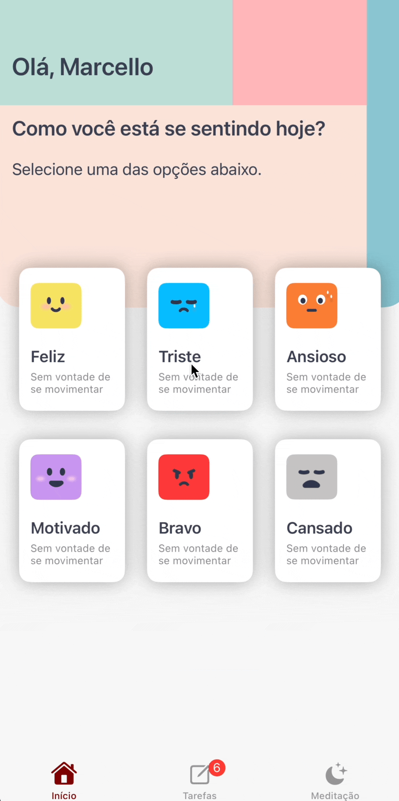

# EvenBetter

[](https://swift.org)
[](https://developer.apple.com/xcode/swiftui/)
[](https://developer.apple.com/documentation/swiftdata)
[](https://developer.apple.com/ios/)


EvenBetter é um aplicativo de iOS que oferece suporte ao usuário em sua jornada de bem-estar pessoal e produtividade, através de um conjunto de ferramentas intuitivas e acessíveis.


## Índice

- [Demonstração](#demonstração)
- [Instalação](#instalação)
- [Uso](#uso)
- [Funcionalidades](#funcionalidades)
- [Tecnologias Utilizadas](#tecnologias-utilizadas)

## Demonstração

Aqui estão alguns screenshots e GIFs do aplicativo em ação:

<div style="display: flex;">
  
  
  
  
</div>


## Instalação

Para configurar o projeto localmente, siga os passos abaixo:

1. Clone o repositório:
   ```bash
   git clone https://github.com/usuario/evenbetter.git
   cd evenbetter
   open evenbetter.xcodeproj
   Cmd + R
   ```
   ## Uso

Para utilizar o aplicativo, siga os passos abaixo:

1. Abra o aplicativo.
2. Navegue até a tela principal.
3. Siga as instruções na tela para utilizar as funcionalidades.

## Funcionalidades
  
  
- [x] Gestão de Tarefas: Adicione, edite e exclua tarefas.
- [x] Desafios Diários: Complete desafios diários para um estilo de vida saudável.
- [x] Player para Meditação: Ouça faixas relaxantes de meditação.
- [x] Registro de Humor e Bem-estar: Registre seu humor e bem-estar diário.

## Tecnologias Utilizadas

### SwiftUI
[SwiftUI](https://developer.apple.com/xcode/swiftui/) é uma framework da Apple para construir interfaces de usuário declarativas. Ele permite a criação de UIs dinâmicas e responsivas de forma rápida e eficiente, utilizando uma sintaxe simples e intuitiva.
### Swift
[Swift](https://swift.org/) é uma linguagem de programação poderosa e intuitiva desenvolvida pela Apple. Ela é usada para criar aplicativos para iOS, macOS, watchOS e tvOS. Swift é conhecida por sua segurança, performance e facilidade de uso.
### Combine
[Combine](https://developer.apple.com/documentation/combine) é uma framework de programação reativa da Apple. Ela permite que os desenvolvedores manipulem e processem valores assíncronos ao longo do tempo, facilitando a gestão de eventos e dados assíncronos.
### SwiftData
[SwiftData](https://developer.apple.com/documentation/swiftdata) é uma maneira rápida, poderosa e fácil de usar para armazenar dados localmente. Ele permite a criação de objetos personalizados, definição de relacionamentos, recuperação com filtragem e classificação, e sincronização com o iCloud usando CloudKit.
### CloudKit
[CloudKit](https://developer.apple.com/documentation/cloudkit) é a framework de serviços em nuvem da Apple. Ela permite que os desenvolvedores armazenem e gerenciem dados na nuvem, facilitando a sincronização de dados entre vários dispositivos. CloudKit oferece suporte a cache offline mínimo e depende da rede e de uma conta iCloud válida para armazenar dados específicos do usuário.


[swift-image]:https://img.shields.io/badge/swift-5.10-orange.svg
[swift-url]: https://swift.org/
